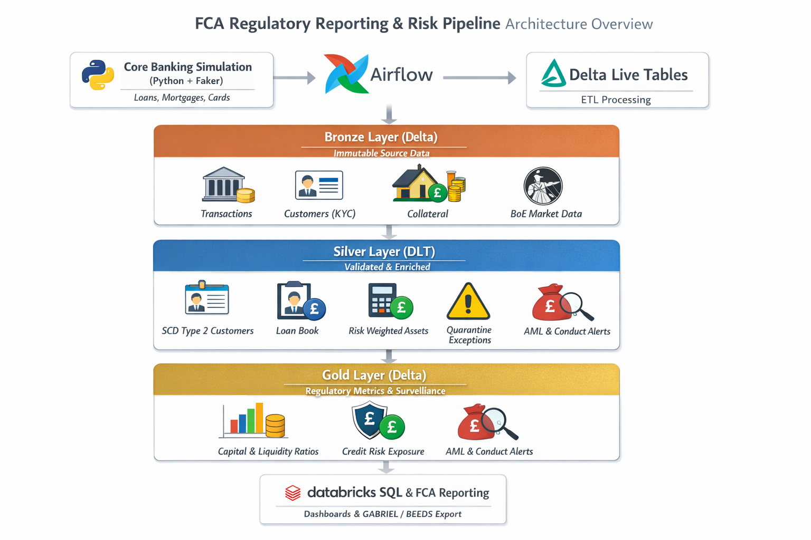
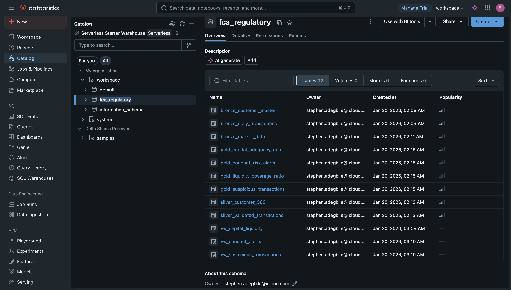
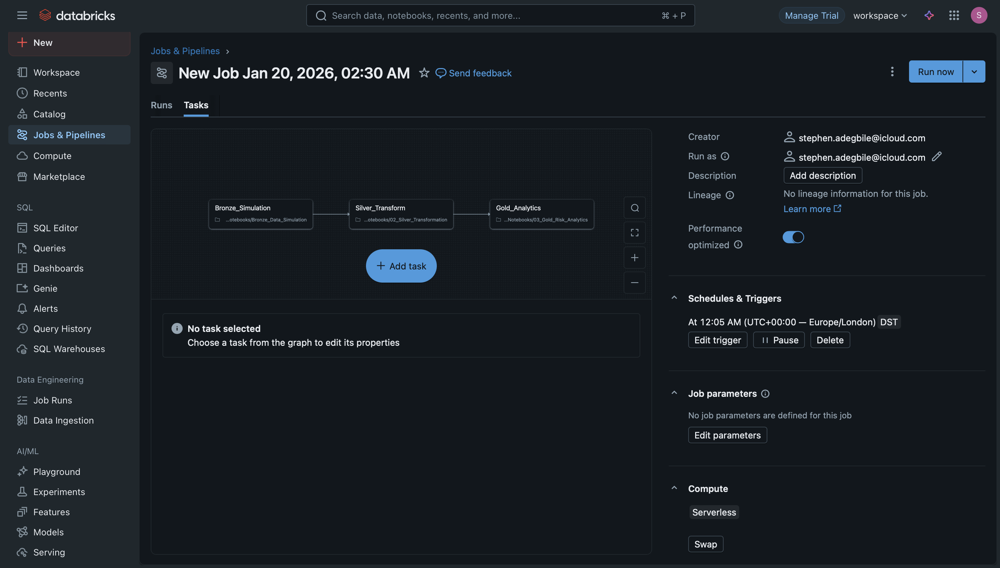
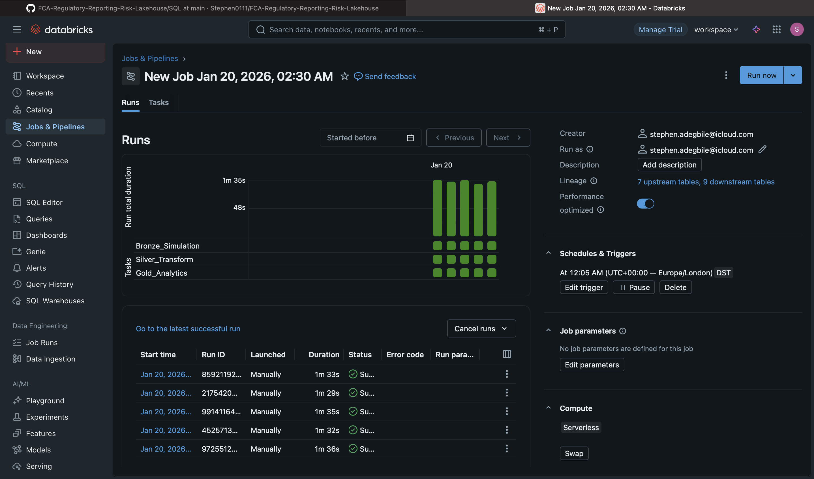
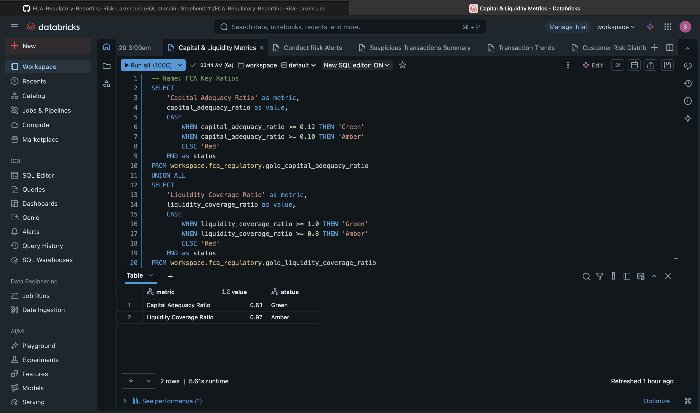
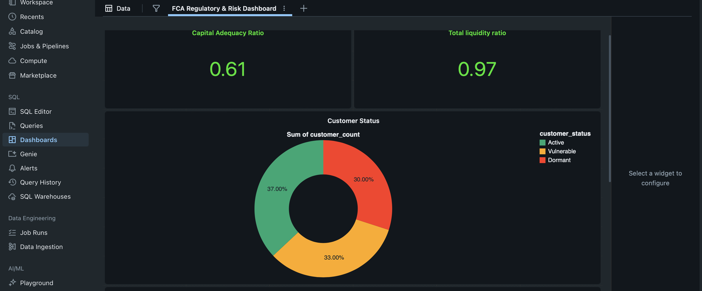
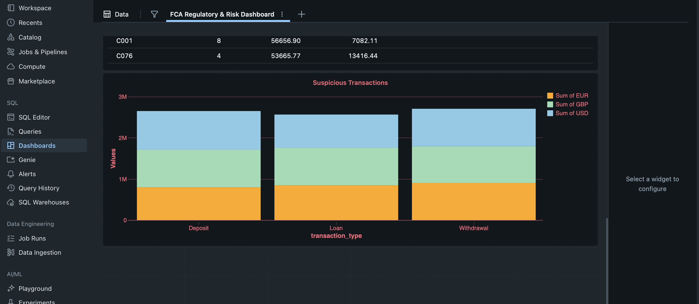
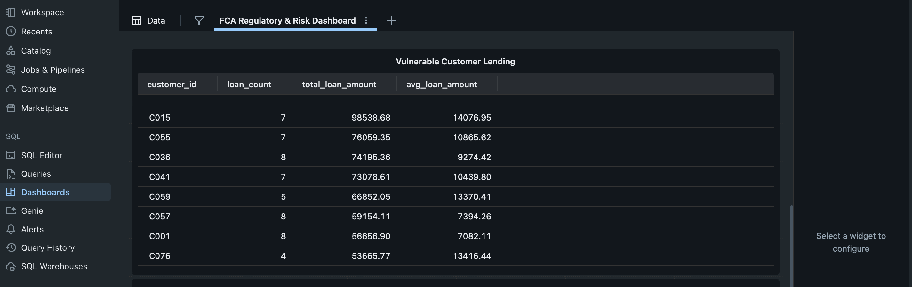

# FCA Regulatory Reporting & Risk Lakehouse on Databricks  
*A Production-Grade Financial Services Data Engineering Platform for Regulatory Compliance, Risk & Conduct Surveillance*

This project implements a **realistic, FCA-aligned regulatory reporting and risk analytics platform** designed to mirror how UK financial institutions meet **Financial Conduct Authority (FCA)** and **Basel III** regulatory obligations.

It simulates core banking transaction data and market data, processes it through a **Databricks Lakehouse architecture**, enforces **regulatory-grade data quality**, and produces **audit-ready, point-in-time regulatory metrics** and **FCA-compliant submission outputs**.

The solution is intentionally designed at a **mid–senior data engineer level**, focusing on **governance, auditability, data quality, and regulatory correctness**, rather than simple ETL.

---

## Architecture Overview

---

## Business Use Case

**Industry:** Financial Services  
**Regulator:** Financial Conduct Authority (FCA)  
**Primary Objectives:**
- Automated regulatory reporting (FCA / Basel III)
- Capital & liquidity risk monitoring
- Credit risk exposure analysis
- Conduct risk & AML surveillance
- Full audit trail and point-in-time reconstruction

---

## Key Features

### Regulatory-Grade Data Engineering
- **Immutable Bronze layer** for audit compliance
- **Delta Live Tables expectations** enforcing FCA rulebook requirements
- **Time travel & versioning** for regulatory reconstruction
- **SCD Type 2** customer history for conduct risk investigations

### Risk & Capital Calculations
- Capital Adequacy Ratio (CET1 / RWA)
- Liquidity Coverage Ratio (LCR)
- Credit Risk Exposure (PD, EAD, LGD)
- Interest Rate Risk (BoE rate shocks)
- Regulatory threshold alerts (amber/red)

### Conduct & Financial Crime Surveillance
- AML red flags:
  - Cash transactions > £10,000
  - Rapid movement across jurisdictions
  - Structuring / round-amount detection
- Conduct risk alerts:
  - Vulnerable customer lending
  - Affordability breaches
  - Customer status changes (SCD2)

---

## Tech Stack

| Layer | Technology | Purpose |
|------|-----------|---------|
| **Lakehouse Platform** | Databricks | Unified analytics & governance |
| **Storage Format** | Delta Lake | ACID, versioning, time travel |
| **ETL / Processing** | PySpark | Large-scale transformations |
| **Data Quality** | Delta Live Tables | Expectations & quarantines |
| **Orchestration** | Databricks Workflows + Apache Airflow | Daily & month-end pipelines |
| **Governance** | Unity Catalog | Lineage, access control |
| **Market Data** | Bank of England API | Rates & economic indicators |
| **Visualization** | Databricks SQL | Risk & compliance dashboards |
| **Language** | Python | Simulation & transformations |

---

## Data Model (Lakehouse)

### Bronze – Source Systems (Immutable)
- `bronze_daily_transactions`
- `bronze_customer_master`
- `bronze_market_data`
- `bronze_collateral_valuations`

> Append-only to meet regulatory audit requirements.

---

### Silver – Validated & Enriched
- `silver_validated_transactions`
- `silver_customer_360` (SCD Type 2)
- `silver_loan_book`
- `silver_risk_weighted_assets`
- `silver_exceptions` (failed DLT expectations)

**Key Concepts:**
- Mandatory field enforcement
- Referential integrity
- Effective date tracking
- Quarantined bad data (never silently dropped)

---

### Gold – Regulatory & Surveillance Outputs

#### Regulatory Metrics
- `gold_capital_adequacy_ratio`
- `gold_liquidity_coverage_ratio`
- `gold_credit_risk_exposure`
- `gold_operational_risk_events`

#### Conduct & Financial Crime
- `gold_suspicious_transactions`
- `gold_conduct_risk_alerts`

#### Regulatory Submissions
- FCA-compliant **GABRIEL / BEEDS XML-ready tables**

---

## Orchestration Strategy

### Daily (Databricks Workflows)
- 01:00 – Generate simulated transactions
- 02:00 – Bronze ingestion & Silver validation
- 04:00 – Gold risk metrics (SLA: before 08:00)
- Morning dashboards for risk committee

### Month-End (Apache Airflow)
- Dependency-driven close
- Reconciliation checks
- FCA submission generation
- SLA alerts & retry logic

---

## Data Quality & Audit Controls

- **100% completeness enforced** for regulatory-critical fields
- Daily reconciliation:
  - Transaction movements vs loan book deltas
- Full audit trail:
  - User, timestamp, data version, transformation
- Delta time travel:
  - “What was the CAR on 31/03/2024?”

---

## Visualisation & Reporting

### Databricks SQL Dashboards
- Capital adequacy gauge (green / amber / red)
- Credit exposure heatmaps
- AML alert queues
- Regulatory submission readiness tracker

### Automated Alerts
- Slack / Email notifications for breaches
- SLA violations escalated automatically

---

##  Project Outcomes

This repository demonstrates **real-world financial data engineering**, not toy pipelines:
- FCA-aligned governance
- Regulatory-grade data quality
- Auditability by design
- Clear separation of Bronze / Silver / Gold
- Production-style orchestration & SLAs

It reflects how **UK banks and financial institutions** actually design platforms for **regulatory scrutiny, inspections, and risk committees**.

---

**Status:** Portfolio / Demonstration Project  
**Audience:** Data Engineers, Analytics Engineers, Cloud Engineers, Financial Services Recruiters
